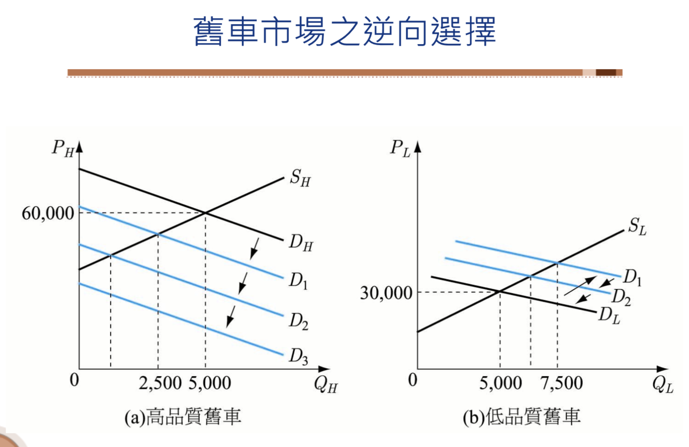
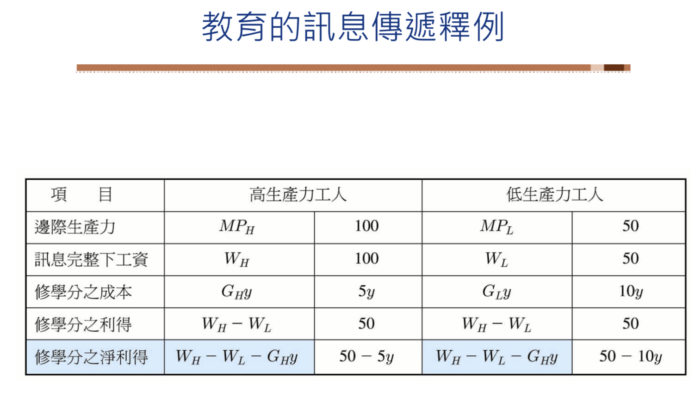
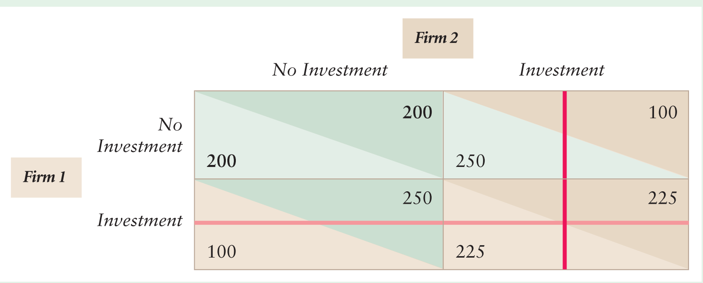

# Asymmetric Information

## Adverse Selection 逆向選擇

### 什麼是資訊不對稱

交易雙⽅所擁有的資訊不⼀樣。交易的某⼀⽅擁有的資訊多於另⼀⽅，買賣雙⽅所掌握的商品的訊息差異很⼤。

Q： 資訊不對稱會是問題嗎？

(1)『夏天到了，⽼師去市場買西⽠，可是不會挑，所以請⽼闆替⾃⼰挑⼀個又甜又好吃的西瓜。

請問老闆挑出來的西瓜一定好嗎？
如果不好，是老闆故意的？還是無意的？如何判斷？

(2) Question: 可不可能存在每⼀個⼈都像華盛頓⼀樣，說⼀是⼀表裡如⼀的世界？

『假設在⼀個專門賣⽔果的市場裡，所有的攤販都是天⽣誠實的⼈，不會短少⽄兩，也按品質將⽔果分及出售。
有⼀天⽣意興隆，老闆忙的暈頭轉向，結果看錯⽄兩⽽少找了幾⼗元，又錯把次等的梨混在上等梨之間。
晚上回家盤點時，意外發現今天多賺了⼀些錢。但是老闆誠實正直的賣⽔果，童叟無欺。
後來又有幾次類似的情況發⽣，此時老闆發現了⼀個事實：
顧客不會發覺，自⼰又能多賺點，為何不乾 脆『意外』的犯幾次錯誤呢？

因此，當所有小販是誠實時，容易出現不誠實的小販，使個⼈收⼊增加。同樣的，當所有小販都是不誠實時，會出現誠實的小販，使個⼈收⼊增加。』

無論是從『全部誠實』或『全部不誠實』開始，世界都不會停留在這兩個極端上。
經過⼀段時間的發展演變，極端世界逐漸消失，世界同時存在誠實與不誠實的⼈。

(3) Question: 誠實為上策？

Robert Frank 認為如果資訊完全，每個⼈都知道對⽅葫蘆裡賣的是什麼藥，誠實與否的問題根本不存在。

只有在資訊不完全的情況之下，誠實的特質才有其價值。
在⼈與⼈互動頻繁的情況下，誠實的⼈容易獲得別⼈的信任，可有較⾼的競爭⼒。
然⽽任何⼈都可以說『我誠實』， 如何判斷呢？
在資訊不完整的情況下，⼈會發展出各種⽅式克服資訊缺憾的障礙，如看⾯相、看眼神與表情！
只是不是所有的⼈都會選擇誠實，如不客氣我吃過了，家裡有事不能去。因此誠實不⼀定是天⽣的，可以是後天所選擇的最適⾏為。

例：某⾼級西餐廳使用昂貴典雅的餐具。因為⽣意興隆，餐具使用率很⾼，難免有些損耗。
有些瑕疵的餐具不適合在餐廳繼續使用，丟掉又很可惜。
於是經理決定要將這些略有瑕疵的餐具，⼤⽅的送給員⼯，不但可做犒賞，也不暴殄天物。
可是，這辦法實施後，餐廳經理發現餐 具的耗損率明顯上升。請問出了什麼問題？
碗盤破損可能是有意或無意造成的，從耗損餐具的外觀來看，⼆者 實難加以區別。
因此，新規定等於提供員⼯誘因，毀壞餐具帶回家，好⼼沒好報。
反⽽是把瑕疵品打破，對整個餐廳⽐較好。』

～好⼼沒有好報，往往是缺乏智慧。

### 資訊不對稱導致機會主義行為

在資訊不對稱的情形下，參與交易或交往的⼀⽅可能隱藏⾃⼰的私有資訊；藉著提供不真實的資訊以求增加⾃⼰的福祉，但同時卻傷害到另⼀⽅的利益。這種資訊不透明的情形會妨礙市場交易。

- 兩種資訊不對稱的類型:隱藏特性與隱藏行為。
- 兩種機會主義行為: 逆向選擇與道德危險。

(1) 逆向選擇係指訊息優勢方藉由將自己不利的訊息隱藏(hidden characteristic)，使得訊息劣勢無法得知而做出了較差的選擇。

(2) 道德危險係指訊息優勢方採取了隱藏行動(hidden action)，使得訊息劣勢方無法觀察到，因而遭受到損失的現象。

Summary:

~ What is asymmetric information?

**Asymmetric Information**: One party to a transaction had relevant information that another party lacks.

- **Hidden Characteristics**: A hidden characteristic is an attribute of a person or thing that is known to one party but unkown to others.
- **Hidden Action**: A hidden action is an act by one party to a transaction that the other party cannot observe.

~ Asymmetric information leads to opportunistic behavior.

- **Adverse Selection**: Adverse selection occurs when one party to a transaction possesses  information about a hidden characteristics that is unknown to other parties and takes advantage of the information.
- **Moral Hazard**: Moral hazard occurs when an informed party takes an action that the other party cannot observe and that harms the less informed party.
In other words, an informed party takes advantage of a less-informed party through a hidden action.
- Asymmetric information causes market failures when informed parties engage in opportunistic behavior at the expense of uninformed parties.
Opportunistic behavior destroys many desirable properties of competitive markets.

This chapter focuses on adverse selection and unobserved characterisitcs.
Adverse selection often leads to markets in which some desicralbe transactions do not take place
or even the market as a whole cannot exist.
The next chapter concentrates on moral hazard problems due to unobserved actions and on the use of contracts to deal with them.

One of the most important problems associated with adverse selection is that
consumers may not make purchases to prevent better-informed sellers from exploiting them.
As a result, not all desirable transactions occur, and potential consumer and producer surplus is lost.
Indeed, in the extreme case, adverse selection may prevent a market from operating at all.

###  Markets: Products of unknown quality

- 二手車。是否會買到泡水車？車主知道是否泡水，但買方不確定。
- 保險。開車習性只有駕駛自己知道。
- 勞動雇用。雇主希望雇用到能力強、態度佳的員工，但是只有雇員自己清楚自己的能力與態度。

#### 例1: 二手車市場 （檸檬市場，lemon market)

二○○一年諾貝爾經濟學獎得主阿卡洛夫，因研究「資訊不對稱」獲得此項殊榮，引起了經濟學領域中對資訊取得、資訊運用等問題的重視。資訊不對稱影響交易行為的例子在市場上比比皆是，例如：賣舊車的人比要買中古車的人更清楚車的品質。這種資訊不對稱會對市場的運作帶來很大的影響。

George Akerlof (1970) ：資訊不對稱會對經濟行為產生什麼影響呢？

在二手車市場上買賣雙方訊息不對稱。販售舊車的車主（訊息優勢方）最清楚自己車子的真實品質，打算賣舊車的人（訊息劣勢方）無法由外觀或試開完全洞悉舊車的真實品質。

- 賣主知道自己車子的品質，所以會將所賣車子的品質與市場價格做一比較。
  - 當品質高於市價，不會賠錢出售；
  - 當品質低於市價，就會把車子脫手。
- 買主不知道該中古車的真正價值，只知道市場上舊車的平均品質，並依平均品質來推算自己的願付價格。
- 此時，高於平均行情價格的好車乏人問津，好車的車主因為在中古車市場賣不到好價錢而不願意出售；會被送到二手車市場的多為“檸檬”，導致市場上願意出售車子的平均品質降低。買車的人只願付更低的價錢來買車，或是拒買中古車，而被迫做出逆向選擇。
  - 如此反覆推之可得：在資訊不對稱的情況下即使有人想賣車，有人想買車，但市場沒有任何交易發生。
  - 這個結果挑戰了傳統經濟學『市場裡有供給和需求，就自然會有交易產生』的概念，因此獲得諾貝爾獎。

**基本假設**

假設二手車可以區分為高品質的二手車與低品質二手車，且車主完全清楚自己車的品質。

- 高品質二手車的供給曲線為$S_H$，低品質二手車的供給曲線為
$S_B$。前者位置較高，高品質二手車的供給價格較高。
- 買方對於品質高的二手車，願意支付較高的需求價格。$D_G$位置較$D_B$位置高。

**情況一：資訊對稱**

- 訊息對稱下，高低品質的二手車市場交易可達成經濟效率。
  - 若買賣雙方都清楚二手車的品質，那麼市場上所有的車子都會交易成功，且好車的價格會比壞車高。
    - 壞車P=30,000，好車P=60,000。市場是有效率的。
  - 若買賣雙方都不知道二手車的品質，那麼所有車子均會以期望價格交易。     
    - 所有車P=45,000。所有車子均交易成功，市場也是有效率的。但以期望價格售出，好車補貼壞車。

**情況二：資訊不對稱**

- 訊息不對稱下，若只有賣者知道車子的品質，但買者不知道時，高低品質的二手車市場交易無法達成經濟效率。
  - 買方根據好壞車各半時，得到平均品質的需求曲線$D_1$。
    - 在新均衡價格下，願意出售好車的數量為2,500，而願意出售壞車的數量是7,500。
  - 買方在好車約佔四分一下，平均品質需求曲線變為$D_2$。
    - 在最新均衡價格下，更少的高品質舊車出願意出售，低品質舊車出售比例會增加。
  - ...，劣車驅逐良車，經濟效率無法達成。

在資訊不對稱之下，會使得市場上出現劣幣驅除良幣的反淘汰結果。當買賣雙方可取得的資訊不對稱時，使得好壞無法區分，最後，品質較高的商品會逐漸退出，迫使資訊較少的一方只能做出不利的選擇，稱為「逆向選擇」。

- 逆向選擇有濫竽充數的情形，消費者本來想選擇高品質的商品，結果卻只有低品質的商品可選擇。
- 在逆向選擇下，市場即使有交易，也會傷害某⼀⽅的利益；甚⾄有可能沒有任何交易產⽣。

Summary:
If everyone has the same information, all cars sell.
As a result, the market is efficient because the goods go to the people who value them the most. All current owners, who value the cars less than do the potential buyers, sell their cars.

It does not matter whether all buyers and sellers have full information or all lack information. It's symmetry of information that matters. In other words, if buyers have the same information as sellers, no adverse selection problem arises. However, when sellers have more inforamtion than do buyers, adverse selection is likely to occur.

Note that the following belief is untrue. If consumers know that some goods are low quality and others are high quality, but not which, all the goods will sell for the aberage price of the two types of goods.

#### 例2: 汽車保險市場的逆向選擇

Hidden characterisitcs and adverse selection are very important in the insurance industry.

保險公司在面對車主投保時，並無法確知此人的開車習性，而車主本身很清楚自己是否愛開快車或遵守速限。因此，車險市場上從載著資訊不對稱的現象。

假設市場上保車險的車主有兩類：飆車族有A人、肇事率為p；遵守速限族有B人、肇事率為q；p>q且均為風險中立者。
一旦發生車禍，損失為C元；兩種車主均保全險，公司會完全理賠C元的損失，在公平保費下，公司利潤為0元。

**情況一：資訊對稱**

如果保險公司知道投保者屬於哪一類型的駕駛，在公平保費下，對飆車族的駕駛每人收取$F_A=pC$元的保費，對遵守速限族的駕駛每人收取$F_B=qC$元的保費。由於$p>q$，所以$F_A>F_B$，肇事率高的駕駛繳交較高的保費。

**情況二：資訊不對稱**

如果保險公司不知道投保者屬於哪一類型的駕駛，統一收取保費$F$元。在公平保費下，可以計算出公司收取的保費。

$Revenue = F(A+B)=C(pA+qB)=Expenditure$

公平保費為$F*=\frac{C(pA+qB)}{A+B}$

- 飆車族的投保意願，若其財富為$W_A$，則風險中立者投保前提為投保後的財富>未投保的財富。

$W_A-F*>W_A-pC$，亦即$pC>F*$或$\frac{pC(A+B)}{A+B}>\frac{C(pA+qB)}{A+B}$

因此，飆車族在保費$F*$下一定會投保。

- 遵守速限族不會投保，若$qC<F*$，亦即$\frac{qC(A+B)}{A+B}<\frac{C(pA+qB)}{A+B}$

- 因此，保險公司收到的都是飆車族的保戶，發生逆向選擇。

#### 例3: 勞動市場

勞動市場中，雇主不知應徵勞工的工作能力，因此訂出一個平均的工資，結果導致能力低的勞工樂於領取較高的平均工資而前來應徵。能力高的勞工則不願意領取此一較低工資而不願來應徵，結果故者雇用到的多是低能力者。

總之，訊息不對稱導致逆想選擇。訊息弱勢方因為無法得知真實訊息，因而採取了預期或平均的態度，而此一態度辨識造成逆想選擇的成因。

### 如何避免資訊不對稱的影響？

1. 搜集資訊：

一般而言，我們手上常沒有完整無誤的資訊，行為者在作決策之前需要先蒐集資訊以求增進自己的福利。但是搜集資訊要付出成本，因此，值得思索在主觀和客觀的條件之下，搜集資訊的最佳決則。

『小朋友很喜歡收集石頭。有一天到古堡的花園玩，主人告訴小朋友，他可以選一顆石頭帶回家，不過不能回頭挑。小朋友看到好多漂亮的石頭，邊走邊猶豫，是該拿現在這個，還是等前面更漂亮的石頭？結果，他發現最後手上空無一物。』

～石頭越撿越小。自設標準，可能空手而回，雖然下一個可能更好。

若主人告訴小朋友，可以選很多次但一次手上只可保留一個，與只可以選一次，結果有什麼不同？

~ 可以一直換時，越選越好。

Question: 撿石頭的過程中，什麼是你自求多福的規則？
         人生有什麼是只能選一次，什麼是可以邊選邊換？

2. 法律規範

政府可藉由立法，規範賣方對其產品負一定責任，如此擁有劣品質的賣方變需要考慮法律上的責任，因此在交易之前便會將產品的品質告知買方，如此變可以降低訊息不對稱的程度。

3. 建立信譽、口碑或提出保證

通常我們都是在東西買了之後才知道產品或服務的品質好不好，如果業者銷售的商品確實不錯，在消費者之間會逐漸形成良好的口碑，業者也會因此建立優良的信譽，使生意愈做愈好。同時，如果企業在消費者心中已建立良好的品牌形象，則這個品牌就成為替公司傳遞資訊的重要指標，有助於消費者對產品產生某種程度的信賴感。或者由賣主提供保固服務，在保固期間的維修及保護費用一律免費。

### Signaling and Screening 傳訊與篩選

市場訊號：當資訊不對稱時，市場中擁有較多資訊的一方，可釋出訊號讓對方知悉，以解決資訊不對稱的問題。

在資訊不完全的情況下，區別自己和他人的差異，讓別人依此推論。傳訊理論提出者Michale Spence在2001年獲得了諾貝爾經濟學獎。

例1: 二手車市場

傳訊面：買方傳遞訊號時需要考慮成本與效益。

假設:

- 市場上有賣二手車的高品質車行H，也有低品質車行L。前者購車成本30萬，後者則是10萬元。
- 買方對於高品質二手車出價40萬，低品質二手車20萬。如果無法判斷高低品質時，以平均品質價格30萬元買車。
- H車行為凸顯自己車行的品質，打算推出買車者享有X萬元的售後服務優惠，使得消費者認定H車行為高品質而願意出價40萬。L車行若要跟進，則必須付出2X萬元的成本進行售後服務。

誘因相容的條件：

Q：H車行要如何選擇X才能區隔市場，並增加利潤呢？

(1) 只有H車行能做出保證策略，L車行不可以。

- 當L選擇保證策略，買方無法區別H與L時，L車行的利潤為$30-10-2X$。
- 當L不選擇保證糙略時，買方可以區別H與L時，L車行被認為是低品質時的利潤為$20-10$
- L車行跟進的利潤低於不跟進，$20-2x<10$，即$X>5$。

~若H車行售後服務超過五年的話，L車行不會跟進提供售後服務。

(2) 當L不會提供保證策略時，H執行保證策略的利潤比不執行高。

- H不執行保證策略，買方無法區隔，則其利潤文$30-30=0$。
- H執行保證策略，買方可以區隔時，其利潤為$40-30-X=10-X$。
- H車行選擇執行，若$10-X>0$，即$X<10$。

~當L車行不提供保證策略，H車行的售後服務年限低於10年，H車行才有誘因執行售後服務保證。

～因此，H車行將售後服務訂在5~10年間，便可以區隔市場。

例2：教育市場

傳訊理論認為：學歷之所以和工資相關，是因為文憑在就業市場中扮演了篩選(screening)與傳訊(signal)的雙重角色 (Spence, 1973）。

傳訊面：由於人的能力有高低之分，接受高等教育所需付出的代價會因能力的高低而有所差異。在自願性選擇的前提下，能力強的人會選擇進大學唸書，能力弱的人則會因為唸大學所需支付的代價較高，所以不會選擇進入大學就讀。易言之，個體會依照自身能力的高低，衡量取得文憑的利弊代價，然後自願性做出是否接受教育的理性投資選擇。

假設：

- 應徵工人只有兩種：一為高生產力工人，邊際生產力為$MP_H$；一為低生產力工人，邊際生產力為$MP_L$，而$MP_H>MP_L$。
- 若財貨與勞務均為完全競爭市場，物價為1，則在訊息完整下，兩人薪水為$w_H=P*MP_H=MP_H$，$w_L=P*MP_L=MP_L$，而$w_H>w_L$。
- 令$Y$表示修課的學分數。若修課數超過$Y*$的工人，便被視為高生產力者，薪水為$w_H$。若修課數低於$Y*$的工人，便被視為低生產力者，薪水為$w_L$。
- 假設教育部會提高生產力，僅傳遞訊息。
- 修習學分的成本，高生產力工人為$C_H=G_H*Y$，低生產力工人為$C_L=G_L*Y$，而$C_H<C_L$

誘因相容條件：

- 混和均衡pooling equilibrium：高低生產力的工人選擇均相同。
- 分離均衡separating equilibrium：高低生產力的工人選擇不同，在此高生產力工人選擇修課，低生產力工人不選(修習學分的成本與效益)。

高生產力：$w_H-w_L>G_HY*$

低生產力：$w_H-w_L<G_LY*$

可推得$\frac{MP_H-MP_L}{G_L}<Y*<\frac{MP_H-MP_L}{G_H}$

當學分數滿足上述區間時，高生產力工人會去修課並傳出一訊息，我是高生產力者，於是老闆付他較高的薪水。低生產力工人不會去修課並傳出一訊息，我是低生產力者，於是老闆付他較低的薪水。
如此，避免了逆向選擇。

篩選面：雇主與求職者在招聘人員過程中，雙方存在資訊不對稱的情況。由於每位勞動者的勞動生產力各不相同，只有求職者清楚自身勞動生產力的實際情況，雇主卻無法確定求職者勞動生產力的高低。在此情形下，既然教育具有篩選個體能力高低的機制，那麼就可以把學歷當作是能力的指標。即使教育無法提高勞動生產力，文憑也能夠提供雇主有用的訊息，可以作為選擇受雇者的依據。換言之，雇主會依照勞動市場上受雇者的學歷，決定相對應的工資結構，學歷高者工資也相對提高 (Spence, 1973)。

c. 忽略政策面-高等教育市場供給的變化情形。

依據Spence的理論，他將眾人區分為能力高低不同的兩群人，這兩群人在志願的狀況下，依照自身能力高低做出是否接受高等教育的理性選擇。然而，有關高等教育市場供需變化所造成的高等教育機會緊縮或擴張的現象，以及此現象對於學歷和工資之間關係的影響，在傳訊理論中卻未被觸及。

我們可以想像：在供給有限的情況下，部分能力高的人即使有意願接受高等教育，也可能被摒棄在窄門之外，無法順利進入大學就讀。相反的，在供給擴張的狀況下，即便能力低的人也有機會上大學。在現實世界中，高等教育市場的供給經常受制於政府，這種現象在台灣和中國大陸尤其明顯：政府掌握高等教育政策的決策權，可以對於高等教育採取數量管制政策。但是，在傳訊理論中，政府管制政策的影響並未被考量。

討論：能力與文憑

金融證照真能讓人身價不凡？

『面對金控時代的來臨，最近金融人員最流行的，就是到金融研訓院報考執照。似乎證照愈多就愈有保障，但實況真是如此嗎？擁有相關證照似乎讓自己更有競爭力，所以大家一窩蜂去考照；但合格率過高，人手一張的證照到底有沒有價值？

去年一年，金融研訓院舉辦的六項證照測驗，吸引約34萬人報考。每人每次報名費650元，加上書籍費約600到800元，平均每人每次考試約要花費1300元。因此，光是測驗，金研院去年就有2億元收入，佔整年營收30%，總營收突破4億5000萬，比前年增加1億多元。

在目前金研院開辦的六項測驗中、只有銀行內控基本測驗、信託業務專業測驗是財政部要求相關從業人員必備的法定證照，其餘初階授信、初階外匯測驗、理財規劃等四項專業能力測驗，則是金研院自行開發的證照考試。

有趣的是，不論是否有法定規定，金研院舉辦的各項考試，報考人數都很驚人。光是信託專業測驗證照一項，舉辦三期來，有高達15萬人次報名，遠超過目前銀行行員人數，其他報考人包括證劵、壽險業員工，以及為了增加未來競爭力的大學生等。沒有法定要求具備證照的理財規劃人員專業能力測驗，首次開辦就有8萬6000多人報名。

有許多人甚至是不清楚考照的目的，只是一窩蜂想取得證照。一家本土銀行訓練部主管形容，原本一項考試只有200位相關業務人員需要報考，最後卻來了一千位，「那八百位員工現在與未來的工作內容和考試內容無關，實在不懂這張證照對他有何幫助？」

不論證照實用與否，在金控公司成立後，多一張證照就多一份安全感，是金融人員自然的心理需求。不過，如果你知道不少人K了三天參考書就考到，妳很難會相信這樣的專業證照會有什麼價值？普遍來說，金研院舉辦的證照考試，合格率的確頗高。根據統計，合格率最低的是授信測驗，約在二到三成間；其餘考試合格率多在四到六成之間，而「銀行內控基本測驗」的合格率則在八成五以上。
發照如發卡？

面對學員的質疑，院長薛琦表示，可能是彼此期待有些落差。他說：「就好像『駕駛執照』一樣，證照是讓從業人員取得基本能力，對專業領域有初步概念，是執業的基本要求，而非在刁難大家。」

和國外專業證照的測驗過程相比，台灣金融專業證照才起步，的確有很大的進不空間。國外證照考試多半要求二到三年實務經驗、有考前的課程訓練，而且取證後每隔一段時間，還會被要求持續進修，確保專業知識札實。而且國外考試進行時間兩天，但台灣只考一個上午，考題內容上，台灣全是單選題，國外則有很多申論題，比較能考出實力與基礎概念。

從最基礎的入門證照到高階證照，金研院有囊括證照市場的野心。但金研院開出的證照，既然多標榜「專業能力測驗」，更該嚴格對合格比例、考試方式把關；或是清楚定義為「基礎能力測驗」，讓需求者不必期待過高。證照市場的活絡，也相對提升金融人員的實力。但未來，金研院應再多聽市場的聲音，為提升證照價值，特別是國際化證照而努力。』

## Challenge Case: Dying to Work

**In part because of the differing amounts that firms invest in safety, jobs in some firms are more dangerous than in others.**
In 2010, the United States had a particularly bad year for major disasters:
A blast at a refinery in Washington States killed 7 workers, 11 workers died when BP’s Deepwater Horizon oil rig exploded in the Gulf of Mexico, 29 coal miners died in a disaster at Massey Energy’s West Virginia mine explosion, and 33 Chilean miners were trapped half a mile underground for 69 days in another mine disaster. These disasters are only the tip of the iceberg as thousands of workers are killed on the job every year - 4,821 in 2014.
Major disasters have occurred in other countries.
An apparel factory collapse in Bangladesh killed 1,129 workers in 2013.
A warehouse explosion in the port of Tianjin, China, killed 173 workers in 2015.
A factory blask killed 23 workers in Bangladesh in 2016.

**Prospective employees often do not know the injury rates at individual firms
but they may know the average injury rate over an entire industry,
in part because givernment reports such statistics.**
Injury rates vary dramatically by industry, ranging from only 0.9 fatal injuries per 100,000 workers in the financial services industry to 9.7 in construction and 12,4 in mining.
Some occupations are particularly dangerous.
Logging had a fatal injury rate of 91.3 per 100,000 workers;
fishing 75,0; agriculture, 22.9; and driving a truck, 23.6.
On the other hand, safe occupations includes sales, 1.6, and educational services, 0.7.

**If people are rational and fear danger,
they agree to work in a dangerous job only if that job pays a sufficiently higher wage than less-risky alternative jobs.**
Economists have found that workers receive compensating wage differentials in industries
and occupations that government statistics show are relatively risky.

**However, if workers are unaware of the greater risks at certain firms within an industry,
they may not receive compensating wage differentials from more dangerous employers within that industry.**
Workers are likely to have a sense of the risks associated with an industry.
Everyone knows that mining is relatively risky —
but they do not know which mining companies are particularly risky until a major accident occurs.
For example, in the decade before Massey Energy was acquired by Alpha Natural Resources in 2011,
54 coal miners were killed in Massey mines, a much higher rate than at other mines, yet there’s no evidence that these workers received higher pay than workers at other mining firms.

**Because workers do not know which firms are safer than others,
each firm bears the full cost of its safety investments but does not get the full benefits.**
If workers are aware of the average risk in an industry,
all firms benefit from one firm’s safety investment because that investment improves the industry average.
Thus, other firms share the benefit from one firm’s investment in safety.
Consequently, firms, when making the important strategic decision of how much they should invest in safety,
take this spillover effect into account.

**Does such a situation cause firms to underinvest in safety?
Can government intervention overcome such safety problems?**

工作安全程度不同的職業，藉由補償性工資的調整，讓危險性高的工作薪資高、危險性低的工作薪資低。

藉由政府統計公報所提供的資訊，工人可以知道不同產業的工作風險，所以在危險產業工作的工人的確薪資較高。

通常，同一個產業中不同的廠商，對於安全設備的投資情況不同，在不同廠商工作安全的程度不一樣。
不過，工人並沒有個別廠商投資安全設備的相關資訊，補償性工資機能似乎無從發揮。

請問在資訊不對稱的情況下，廠商是否會低度投資安全設備呢？政府能做什麼來改善工作安全嗎？

## Challenge solution

In the Challenge at the beginning of the chapter, we asked two questions:
Does a firm underinvest in safety if it knows how dangerous a job is but potential employees do not? Can the government intervene to improve this situation?

**Consider an industry with two firms that are simultaneously deciding
whether to make costly safety investments such as sprinkler systems in a plant
or escape tunnels in a mine.**
Unlike the firms, potential employees do not know how safe it is to work at each firm.
They know only how risky it is to work in this industry.
If only Firm 1 invests, workers in the industry do not know that safety has improved at only Firm 1’s plant. Because the government’s accident statistics for the industry fall,
workers realize that it is safer to work in the industry, so both firms pay lower wages.
Thus, **one firm’s safety investment provides an externality to the other firm.**

**A prisoners’ dilemma game illustrates this result.**
The profit table shows how the firms’ profits depend on their safety investments.
Firm 1 has a dominant strategy.
If Firm 2 invests (compare profits in the cells in the right column),
Firm 1’s no investment strategy has a higher profit, 250, than its investment strategy, 225.
Similarly, if Firm 2 does not invest,
Firm 1’s profit is higher if it doesn’t invest, 200, than if it does.
Thus, not investing is the dominant strategy and investing is the dominated strategy,
as is indicated by the horizontal red line through the investing strategy.
Because the game is symmetric,
the same reasoning shows that not investing is the dominant strategy for Firm 2 as well.

**Because both firms have a dominant strategy of not investing,
that combination of dominant strategies is the Nash equilibrium.**
Both firms receive an equilibrium profit of 200.
If both firms invest in safety (the lower right cell), each earns 225,
which is more than they earn in the Nash equilibrium.
However, investment by both firms is not an equilibrium,
because each firm can increase its profit from 225 to 250 by not investing if the other firm invests.

**The firms underinvest in safety because each firm bears the full cost of its safety investments
but derives only some of the benefits.**
In contrast, **if workers knew how safe each firm is,
only a firm that invests in safety would be able to pay a lower wage,
which would change the profit table and increase the likelihood that the firms invest in safety.**

Thus, if the government or a union were to collect and provide workers with firm specific safety information,
the firms might invest.
However, for the government or a union to provide this information,
their cost of gathering the necessary information has to be relatively low.

這個問題可以用囚犯困境來解釋。
因為廠商投資安全設備具有外部性，
一旦投資，廠商就需要支付安全設備的所有成本，卻不能享有投資安全設備的所有好處。
也就是說，廠商投資提高了整個產業的工作安全程度，導致產業薪水下降（補償性工資減少），
但是工人不知道是哪一間工廠（哪一家廠商）投資，真正投資廠商的薪資支付水準和其他不投資的廠商一樣多。
所以，廠商沒有投資意願，會低度投資安全設備。

如果政府可以提供工人個別廠商的投資資訊，確定各廠商的工作安全情況，那廠商比較會投資在工作安全設備上。

# Contracts and Moral Hazards 道德危險

## 當事人與代理人

A moral hazard may occur if a principal contracts with an agent to perform an action and the principal cannot observe the agent’s actions so that the agent takes advantage of the principal.

現實世界中普遍存在著當事人與代理人的問題（principal-agent problem）。
當事人（principal）與代理人（agent）通常是一種雇傭關係，而使得當事人的福利寄託於代理人的行為。代理人是行動者，而當事人是被行動者所影響的一方。

例：保險與道德危險

汽車駕駛沒有投保汽車全險之前，唯恐車禍發生的理賠及修理費用毀使財富縮水，所以開車時小心謹慎，肇事率極低。
一旦汽車假使投保汽車全險之後，認為保險公司會理賠他一切的車禍損失，因此開車不再那麼謹慎小心，肇事率也因此提高，這就是道德危險。

小林的木屋價值A元，如果遭遇火災將損失L元。若他每年花X元像保全公司租警報器及其服務。若不裝火警警報器，發生火災的機率為p；裝火警警報器，發生火災機率為q，而p>q。假設保險公司發現小林家裝有警報器，遂提出每年保費為F元的全險規劃，一旦發生火災便理賠小林L元。假設小林的效用函數為$U=U(M)$，M為木屋的價值。

- 若小林投保後繼續裝警報器，則預期效用為$E_A(U)=qU(A-X-F)+(1-q)U(A-X-F)=U(Q-X-F)$
- 若小林投保後就不裝警報器，則預期效用為$E_B(U)=pU(A-F)+(1-p)U(A-F)=U(A-F)$
- 若$U_A(U)>U_B(U)$，小林決定買全險後不再裝警報器，這就是道德危險。因為發生火災理賠金額(A-F)是一樣的，那何必再花X元呢？

例：勞雇關係與道德危險

資方在雇用勞動後，總是期望工人能兢兢業業地努力工作，然而不可避免的是：總有些工人工作時會混水摸魚，尤其是薪資給付方式更為明顯。工人沒有業績壓力之下，上班容易混水摸魚，這也是一種道德危險。

**道德危險改善之道**

- 加強稽核工作

訊息劣勢方可以透過加強查核的行為來使道德危險的發生情形降低。如在工廠中安裝監視器或雇用工頭監工，都可以使工人混水摸魚的情形降低。

- 誘因相容契約建立（機制設計）

如何設計出一套誘因制度，以使得訊息優勢方能自願達成訊息劣勢方目標的契約，亦即讓代理人儘量朝向當事人的目標努力。

a. 資訊經濟關心的是在資訊不對稱的情形下，如何設計一套誘因制度使資訊較少的一方克服其劣勢，而誘使資訊較多的一方透露出其所擁有的資訊，讓因資訊不對稱所造成的誤導與風險降到最低。

b.諾貝爾經濟學獎 美三學者共得  2007.10.16

　  三位美國的經濟學者，赫維茲（Leonid Hurwicz）、馬斯金（Eric Maskin） 及邁爾森（Roger Myerson），周一共同獲得二○○七年諾貝爾經濟學獎，理由是「為判別市場是否有效運作的經濟理論奠定基礎」。瑞典皇家科學院表示，三位得獎者為「機制設計理論」奠下基礎，得以探究不同機制在配置資源上的良窳與否，及政府是否需要干預。

赫維茲出生於俄羅斯，已歸化為美國公民，是明尼蘇達大學的經濟學教授，今年九十歲，為歷來年齡最高的得獎者。皇家科學院指出，赫維茲提出上述理論，普林斯頓大學教授馬斯金與芝加哥大學教授邁爾森則予以進一步開展，「迄已大為提升我們對最適配置機制的認知」。

皇家科學院指出，「亞當．斯密的經典隱喻，那隻看不見的手，指的是在理想狀況下，市場將確保稀有資源的有效配置。」「但實際上，狀況通常不是理想的。」
三人的研究成果，讓經濟學者、政府及企業，「區分出市場運作良好的情況及市場並未良好運作的情況。」有助於解釋涉及經濟交易的機制及決策程序。這三位得獎人的研究可以幫助評估機構在這些情況下的表現，進而設計出最好的機制以達成目標，例如如何充分發揮社會福利的作用，以及決定運用政府法規的必要性。

c.從所羅門王的故事到機制設計理論

《聖經》上所羅門王的故事是大家耳熟能詳的。兩個女人抱著一個男嬰來到所羅門王跟前，要求他評判到底誰是真的母親。所羅門王見她們爭執不下，便喝令侍衛拿一把劍來，要把孩子劈成兩半，一個母親一半。這時其中一個女人說：“大王，不要殺死孩子。把孩子給她吧，我不和她爭了”。所羅門王聽了卻說：“這個女人才是真的母親，把孩子給她。”這個關於所羅門王的睿智的故事在流傳了兩千年後，有好吹毛求疵的經濟學家跳出來說，故事中的假母親是不夠聰明的，如果她和真母親說同樣的話，那所羅門王該怎麼辦呢？當然，僅僅會責問別人還不是好樣的，我們的經濟學家有備而來。機制設計（mechanism design）理論及其一個主要部分執行（implementation）理論幾乎是完美地回答了這個問題。

所羅門王的問題可以通過一個類似競標的機制來解決。顯然，所羅門王不知道誰是真母親，但他知道真母親比假母親賦予孩子更高的價值，真假母親也都知道這點，並且這是一個普遍知識。所羅門王可以向其中任一母親（姑稱安娜）提問孩子是不是她的。如果安娜說不是她的，那麼孩子給另一個女人（稱其貝莎），賽局結束。如果安娜說孩子是她的，那麼所羅門王可以接著問貝莎是否反對。如果貝莎不反對，則孩子歸安娜，賽局結束。如果貝莎反對，則所羅門就要她提出一個賭注，然後向安娜收取罰金。比較罰金和賭注，如果罰金高於賭注，則孩子給安娜，她只須交給所羅門王賭注那麼多錢，而貝莎要交給他罰金的錢；如果罰金比賭注低，則孩子給貝莎，她給所羅門王賭注的錢，安娜的罰金也歸他。

讀者可以很容易地推出，在安娜是真母親的情形下，她的策略是說孩子是她的，然後貝莎不反對。因為她反對的結果只會導致她要多交錢，因為安娜為了得到孩子並避免白白給出罰金，必然會真實地根據孩子對她的價值拿出罰金；在安娜是假母親的情形下，她的策略是承認孩子不是她的，因為如果她說孩子是她的，貝莎必然會反對，並且貝莎為了得到孩子並少付錢，一定會真實出價，而安娜只有出高出孩子對她的真正價值的錢才會得到孩子，可這就不合乎她的偏好了。

當然，在假母親具有妒忌型效用函數時，上述機制就無效了。她可以出很多錢得到一個並不物有所值的東西。相反，如果她再有錢，只要是一個正常的利己主義者，而機制設計者又是依法辦事的，那麼問題依然好辦。

最後，微觀經濟學的核心是關於制度的。諾貝爾經濟學獎在給了搞社會選擇理論的阿羅和森，給了廣泛探討制度問題的哈耶克，布坎南，諾斯等人，給了為制度研究提供微觀工具-博弈論的納什，豪爾紹尼和澤爾頓，也給了資訊經濟學的莫里斯和維克裏後，好象沒有理由不頒給機制設計的領袖人物赫維茨和馬斯金吧？。

**例：自負額的保險契約**

許多保險都有自負額的規定，持健保卡看病要負擔掛號費與部分醫藥費，比避免醫療資源的浪費。

如果小林的木屋保險規定要支付自付$\alpha$百分比的火災損失。因此發生火災時，小林可以拿到$(1-\alpha)L$元的理賠金。

- 裝警報（無道德危險），發生火災得$A-X-F-\alpha L$元，未發生火災時為$A-X-F$元。預期效用為$E_C(U)=qU(A-X-F-\alpha L)+(1-q)U(A-X-F)$。
- 不裝警報（有道德危險），發生火災得$A-F-\alpha L$元，未發生火災得$A-F$元，預期效用為$E_D(U)=pU(A-F-\alpha L)+(1-p)U(A-F)$。
- 若$E_C(U)>E_D(U)$，則小會裝警報器。

雖然保險公司不希望保險人做出道德危險的舉動，但是保險人的確有誘因做出道德危險的行為，然而透過保險契約中保險自負額的設計，變可能使得投保人也不願做出道德危險的舉動，正與保險公司的期望相同，此為誘因相容契約。

**例：薪資給付制度的設計**

如果雇主以固定薪資給付給員工，在雇主無法全程監督的情況下，工人可能會發生混水摸魚的情況。因此，雇主應設計一種薪資給付制度來使工人主動努力工作，如按件計酬。

- 當事人的目標

公司的收益為$R=R(a, \mu)$，a表示工人努力工作的程度，是偷懶(a=0)或盡責(a=1)，$\mu$表示天候好與壞。若工人偷懶、天氣壞則收益為2，工人偷懶、天氣好則收益為4；若工人盡責、天氣壞則收益為4， 工人盡責、天氣好則收益為8。
公司付給工人的薪水為w，公司的預期利潤為$\pi(a,\mu,w)=R(a,\mu)-w$。

- 代理人的目標

假設工作成本為$C=C(a)=2a$。混水摸魚時，工作成本為0；認真努力時，工作成本為2。工人追求淨工資（NW）極大，$NW=w-C$

- 當事人與代理人追求的目標不同，所以需要設計適當的薪資契約。

(1) 固定薪資給付 $W=w_0$

採用固定薪資將使工人採取低度努力方式工作。

高度努力：$NW_H=w_0-C(a=1)=2-2=0$

低度努力：$NW=w_0-C(a=0)=2-0=2

在風險中立下，工人採取低度努力方式工作，公司獲利1（＝0.5*(2-2)+0.5*(4-2))

(2)敘薪制度與工作態度 $W=w(R(a))$

若工人工作努力，薪水6萬；工作偷懶，薪水1萬。
當公司收入是4萬時，無法判斷工人是努力或偷懶，薪水1萬。

高度努力：$NW(a=1)=0.5(1-2)+0.5(6-2)=1.5$

低度努力：$NW(a=0)=0.5(1-0)+0.5(1-0)=1$

在風險中立下，工人採取高度努力方式工作，公司獲利2.5（＝0.5*(4-1)+0.5*(8-6))

公司處於資訊劣勢時，無法知道工人的努力程度，但透過銷貨收入與工作努力成的連結，可建立薪資契約提高工人努力誘因，同時達成公司追求利潤極大化的目標。

## Challenge Case: Clawing Back Bonuses

A major cause of the 2007–2009 worldwide financial crisis was that managers and other employees of banks,
insurance companies, and other firms took excessive risks.
Looking back on the events that led to the financial meltdown,
Goldman Sachs Chief Executive Lloyd Blankfein admitted that Wall Street firms,
**caught up in the pursuit of profits, had ignored risks,
and that these firms needed to dramatically change compensation practices.**
As he said, “Decisions on compensation and other actions taken and not taken,
particularly at banks that rapidly lost a lot of shareholder value,
look self-serving and greedy in hindsight.”

Bank manager threw accepted lending practices out of the window,
rewarding their mortage brokers for bringing in large numbers of new mortgages regardless of risk.
For example, they granted many load to risky borrowers without requiring any down payment.
A borrower who does not make a down payment is more likely to default - stop mortgage -
than one who make a sizeable downpayment.

During the mortgage market meltdown that started in 2007,
record numbers of mortgage holders defaulted on their loans and their homes went into foreclosure,
where the lender took ownership.
In the San Francisco Bay Area,
69% of families whose owner-occupied homes were in foreclosure had put down 0% at the time of purchase,
and only 10% made the traditional 20% down payment in the first nine months of 2007.
In the United States, foreclosures rose from 100,000 a month in the summer of 2006 to 250,000 in 2007,
300,000 in 2008, and 350,000 in 2009 and 2010, before falling to 225,000 in 2011,
200,000 in 2012, and 95,000 in June 2016.

Brokers abd their managers issued these risky mortgages because they were rewarded
based on the number of mortgages or annual (Short-run) profits.
They didn't worry about lower future profits that would occur
if economic conditions turned bad and borrows defaulted on their mortagages.
The result was terrible lossess for banks, borrowers,
and the overall economy during the Great Recession.

One response called for in the 2010 Dodd-Frank Consumer Protection Act was
the firms institute **clawback provisions,
which allow firms to claw back or reclaim some earlier bonus payments to managers
if their past actions resulted in later losses.**
Many firms instituted such provisions voluntarily.
While only 18% of Fortune 100 companies reported having a clawback policy in 1986,
almost 90% had such a provision by 2013.
In 2016, the U.S. Securities and Exchange Commission proposed a rule
that would require banks and a broad range of financial institutions to have seven-year clawback provisions
for senior executive officers and "significant-risk-taking" employees.
An alternative, similar policy is for a firm to withhold bonuses and other compensation for an extended period
(often several year)
so that **managers receive rewards only for the long-run success arising from their decisions.**

**Why did executives at these banks take these extra risks that resulted in major lost shareholder value?
How can a firm compensate its corporate executives so as to prevent them from undertaking irresponsible and potentially devastating actions?**
In the Challenge Solution,
we examine how a manager’s incentives can be changed to reduce excessive risk taking.
That is,  **Does evaluating a manager's performance over a longer period using
delayed compensation or clawback provisions benefit shareholders?**

回顧2008年金融危機，主要是因為廠商過度追求利潤、忽略風險所致，因此需要改變（賠償金）報酬制度。

在銀行的房屋借貸上面，當時以貸款額度當做計算經理人的薪資的主要依據，也沒有賠償金規定。
經理人因而忽視房貸風險與相關規定，甚至允許沒有頭期款準備金的客戶貸款，
在經濟不景氣時，造成還不起房屋貸款的比例大幅提高，而引發金融危機。
所以，在薪資的制度上需要改變，讓經理人的報酬依照廠商的長期利潤，而非短期利潤來決定。
也就是說，要求經理人除了貸款額度外，也考量貸款風險。
若一筆房屋貸款的風險高，客戶日後容易違約導致銀行虧損，如未付房屋頭期款即貸款者，
銀行可以透過薪酬索回條款，讓經理人分擔風險責任。

請問銀行經理人會冒巨大風險，造成公司與股東的重大損失？
廠商應該如何管理，透過賠償金報酬的誘因制度，避免不良貸款？

又，透過薪酬索回條款，以較長的時間評估經理人的績效是否會對公司與股東較為有利？

## Challenge Solution

In the aftermath of the financial crisis of 2007–2009, most economists and government officials concluded that banks and many other firms in the financial sector had taken on excessive risks.

**First, we answered the first Challenge question** as to why bankers take on excessive risks by showing that they have an incentive to take a hidden, risky action if they’re compensated for success and not substantially penalized for failure.

Traditionally the Las Vegas Home Bank made only prime loans—providing mortgages just to people who were very likely to repay the loans. However, Leonardo, a senior executive at the bank, is considering offering subprime loans—mortgages to speculators and other less creditworthy borrowers. If he makes only prime loans, the bank will earn \$160 million. If he also makes subprime loans, the bank will make a very high profit, \$800 million, if the economy is good so that few people default. However, if the economy is bad, the large number of defaults will cause the bank to lose $320 million.

The probability that the economy is bad is 75%.
Leonardo will receive 1% of the bank’s profit if it is positive.
He believes that if the bank loses money,
he can walk away from his job without repercussions but with no compensation.
Leonardo and the bank’s shareholders are risk neutral.
Does Leonardo provide subprime loans if all he cares about is maximizing his personal expected earnings?
What would the bank’s stockholders prefer that Leonardo do (given that they know the risks involved)?

Answer:

1. Compare the bank’s expected return on the two types of mortgages. If the bank makes both prime and subprime loans, its expected return is (0.25 * 800) + (0.75 * [-320]) = -40 million dollars, an expected loss. That is substantially less than the certain profit of $160 million the bank makes if it provides only prime mortgages.

2. Compare the manager’s expected profits on the two investments. Leonardo earns 1% of $160 million, or $1.6 million, if he provides only prime loans. If he makes prime and subprime loans, he earns 1% of $800 million, or $8 million, with a probability of 25%, and gets no compensation with a probability of 75%. Thus, he expects to earn (0.25 * 8) + (0.75 * 0) = 2 million dollars. Because Leonardo is risk neutral and does not care about the shareholders’ returns, he makes both types of loans.

3. Compare the shareholders’ expected profits on the two types of mortgages. If the bank provides only prime mortgages, the bank’s shareholders earn 99% of the profit from the prime mortgages, or 0.99 * $160 million = $158.4 million. If the bank makes both prime and subprime loans, shareholders earn 99% of the $800 million,
$792 million, if the economy is good. But in a bad economy, the shareholders bear the full loss, $320 million. The expected return to shareholders is (0.25 * 792) + (0.75 * [-320]) = -42 million dollars, an expected loss. Thus, the shareholders would prefer that the bank make only prime loans.

Comment: Given that Leonardo has the wrong incentives (and ignores his responsibility to shareholders), he takes a hidden action—choosing to provide subprime loans—that is not in the shareholders’ best interest. One possible solution to the problem of managers’ and shareholders’ diverging interests is to change the manager’s compensation scheme, as we discuss in the Challenge Solution.

若房屋貸款只有主貸（還款可能性甚高的客戶），而無次貸（多為投機業者或信譽不良者），則銀行能獲利160百萬美元。
如果有次貸，若經濟情況不錯，則銀行可以獲利800百萬美元；若經濟情況不佳，則銀行損失320版萬元。
經濟不佳的機率為75%。

如果銀行有正利潤，則經理人可抽成1%；若銀行有負利潤，則可離職而不用付補償金。
當經理人與股東都是風險中立者，而經理人想要最大化自己的薪資報酬，那麼經理人是否會提供次級貸款呢？
股東想要經理人這麼做嗎？

- 首先，若只有主貸，銀行的利潤為160百萬美金。

若有主貸與次貸，則銀行的期望利潤為-40百萬美金： (0.25 * 800) + (0.75 * [-320]) = -40。

- 其次，若只有主貸，經理人的利潤為1.6百萬美金。

若有主貸與次貸，則經理人的期望利潤為2百萬美金：(0.25 * 8) + (0.75 * 0) = 2  。

- 三者，若只有主貸，股東的利潤為158.4百萬美金：0.99 * $160 million = $158.4 。
若有主貸與次貸，則股東的期望利潤為2百萬美金： (0.25 * 792) + (0.75 * [-320]) = -42。

- 因此，股東希望只有主貸，經理人希望有主貸與次貸。

We now return to the **second Challenge question**: How can a firm compensate its corporate executives so as to prevent them from undertaking irresponsible and potentially damaging actions? One approach is to provide incentives that penalize them relatively more for failure.

We can illustrate this idea by modifying the above answer.
The new compensation scheme gives him the same earnings if he makes only prime loans.
However, now he stands to lose his salary if he chooses to also make the riskier,
subprime loans and the firm loses money.

With the new compensation plan of $1.15 million salary plus 0.25% of positive profits,
if Leonardo provides only prime loans, he makes $1.6 million (= $1.15 million + [0.0025 * $160 million]),
which is the same as he previously made.
If he also makes subprime loans, he expects to earn nothing three-quarters of the time,
and $3.15 million (= $1.15 million + [0.0025 * $800 million]) one-quarter of the time.
As a result, his expected earnings are (0.75 * 0) + (0.25 * $3.15 million) = $0.7875 million.
As he expects to earn more than twice as much from providing only prime loans,
he no longer wants to offer subprime mortgages.

Thus, with this new compensation scheme, the bank shareholders avoid the original moral hazard problem.
Leonardo’s hidden action—whether he offers subprime loans—no longer exposes them to excessive risk.

Before the 2007–2009 financial crisis, contracts creating this excessive risktaking moral hazard were very common, partly because the people designing the contracts—firms’ senior executives—were the beneficiaries of the generous incentives. If shareholders had understood these contracts and had symmetric information,
they would have objected, but few shareholders had the time, the ability,
or sufficient information to scrutinize executive compensation contracts.

新制度：經理人基本薪資為1.15百萬美金，加上銀行利潤的0.25%。

若只有主貸，經理人的利潤為1.6百萬美金：$1.15 million + [0.0025 * $160 million])。

若有主貸與次貸，則經理人的期望利潤為0.7875百萬美金： (0.75 * 0) + (0.25 * $3.15 million) = $0.7875，
$3.15 million (= $1.15 million + [0.0025 * $800 million]) 。

因此，經理人不會提供次級貸款。

在2008金融海嘯之前，道德風險的問題普遍存在，因為銀行在報酬上提供了經理人很強的誘因。
如果股東瞭解契約與不對稱資訊，而他們有時間、能力和資訊的話，就可以反對並設計賠償金薪資制度來防弊。

下面的文字說明（第八版）和第二題的解題觀念是一樣的。

We ask whether evaluating a manager's performance over a longer period and
using delayed compensation of clawback provisions benefit shareholders.
The answer depends on whether the reward a manager receives in the short run
induces the manager to sacrifice long-run profit for short-run personal gains.

Managers prefer receiving pay sooner rather than later because money today
is worth more than the same amount later.
Many managers receive a bonus based on a firm's annual profit.
If a manager can move a major sale from January of next year to December of this year, the firm's total profit over the two years does not change, but the manager receives the resulting performance-based bonus this year such shifts over time, as they do not lower the present value of long-run profits substantially.

Of more concern are managers who increase this year's profit in a way that lowers profit in later year.
Many firms pay a bonus on a positive profit but do not impose fines or penalties for a loss.
Suppose that a particularly policy results in a large profit this year but a larger loss next year.
If the manager gets a bonus on each year's profit,
the manager receives a larger bonus this year and no bonus next year.

In an extreme case, a manager engages in reckless bahavior that increases this year's profit
but bankrupts the firm next year.
The manager plans to grab this year's bonus and then disappear.
Many mortagage and financial instrument managers engaged in such reckless and irresponsible behavior
leading up to 2007-2009 financial meltdown.
Bad decisions at Merrill Lynch, a wealth management firm, cost shareholders billions of dollars,
but senior managers bonuses despite the negative effects of their decisions on shareholders.

A firm can discourage bad managerial behavior if the firm can clawback a bonus given this year
if the firm does not badly next year.
Without a clawback, the manager has a greater incentive to adopt this policy of
increasing profit in one year at the cost of lower profit the next.

Equivalently, the firm may base bonus on profits over several years.
If a bonus is a percentage of the profit over two years,
the manager who increase profit this year at the expense of a larger loss next year receives no bonus.

To illustrate why paying bonuses based on a longer period provides a better incentive structure,
we examine the case of Jim, who is an executive at an auto loan company.
We look at a two-year period. Initially, Jim receives 10% of the amount of the loans he makes in the first year, He can loan to two groups of customer.
Customers in one group have excellent financial histories and repay their loans on time.
Loan to this group produce revenue of $10 million this year,
so that over the two-year period, the firm nets $9 million after paying Jim.
Customers in the other group are much more likely to default.
That group produces $30 million in revenue this year,
but their default in the second year cost the firm $40 million.
After paying Jim $3 million in the first year, the firm suffers a $13 million loss over the two years.

Because Jim prefers receiving $4 million by loaning to both groups to $1 million from loaning to
only only the good risks, he may expose the firm to devastasting losses in the second year.
He may be happy earning a gigantic amount in the first year even if he's fired in the second year.
However, if his bonus is a share of the profit over two years,
he no longer wants to make loans to the risky group.

Starting in 2012, Morgan Stanley paid bonuses to high-income employees over a three-year period.
Similarly, Apple granted stock options and related benefits every two years rather than every year.
In 2016, Wells Fargo Bank clawed back $41 million from its chairman and chief executive in response to a scandal.
